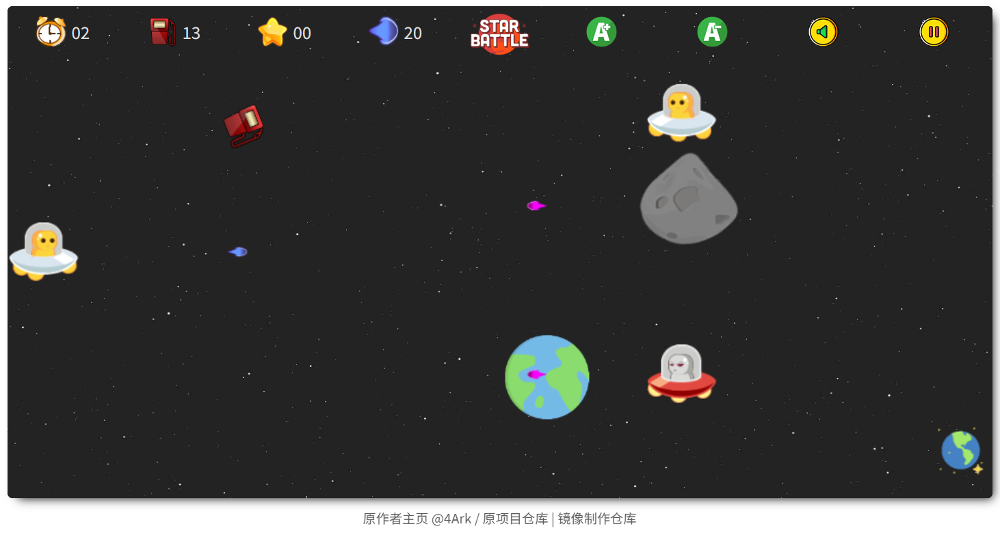

<p align="center">
	简体中文 | <a href="README-EN.md">English</a>
</p>


> 一个使用 JavaScript ES6、Canvas 开发的飞船射击类游戏。
>
> 原为 2017 年阿布扎比世界技能大赛中的题目，后经作者自行开发。

## 部署说明

当前汉化仅适用于 版本：

首先感谢原作者的开源。[原项目地址](https://github.com/gd4Ark/star-battle)

具体汉化了那些内容，请参考[翻译说明](./翻译说明.md)。

只做了汉化和简单修改，有问题，请到原作者仓库处反馈。

有需要帮忙部署这个项目的朋友,一杯奶茶,即可程远程帮你部署，需要可联系。  
微信号 `E-0_0-`  
闲鱼搜索用户 `明月人间`  
或者邮箱 `firfe163@163.com`  
如果这个项目有帮到你。欢迎start。

有其他的项目的汉化需求，欢迎提issue。或其他方式联系通知。

### 镜像

从阿里云或华为云镜像仓库拉取镜像，注意填写镜像标签，镜像仓库中没有`latest`标签

容器内部端口 3000

```bash
swr.cn-north-4.myhuaweicloud.com/firfe/star-battle:2025.05.02
```

### docker run 命令部署

```bash
docker run -d \
--name star-battle \
--network bridge \
--restart always \
--log-opt max-size=1m \
--log-opt max-file=3 \
-p 3000:3000 \
swr.cn-north-4.myhuaweicloud.com/firfe/star-battle:2025.05.02
```
### compose 文件部署 👍推荐

```yaml
#version: '3.9'
services:
  star-battle:
    container_name: star-battle
    image: swr.cn-north-4.myhuaweicloud.com/firfe/star-battle:2025.05.02
    network_mode: bridge
    restart: always
    logging:
      options:
        max-size: 1m
        max-file: '3'
    ports:
      - 3000:3000
```

## 修改说明

增加修改部分具体见 [修改说明](./修改说明.md)。

`./README.md` 增加 `## 部署说明`、`## 修改说明`、`## 效果截图` 部分。

增加目录 `./图片`
新增文件 `./.dockerignore`、`./Dockerfile`、`./修改说明.md`

## 效果截图




## Demo 预览

在线预览地址：[链接](https://4ark.me/star-battle)

## 游戏规则

1. 使用 `W`、`A`、`S`、`D` 控制飞船，按下 `Space`发射。
2. 燃料初始值为15，每秒递减1点，当燃料值为0时，游戏结束。
3. 触碰掉下的燃料瓶可增加15点，最大值为30点。
4. 击中敌方飞船增加5分。行星需击中两次，增加10分。击中友方扣除10分。
5. 碰撞敌方损失15点燃料，碰撞友方扣除10分。
6. 游戏允许负分。
7. 按下 `P` 暂停游戏，按下 `M` 静音。

## 作者

> [Blog](https://4ark.me/) · GitHub [@gd4Ark](https://github.com/gd4Ark)

## 最后

如果觉得我的项目还不错的话👏 ，就给个 star ⭐ 鼓励一下吧~